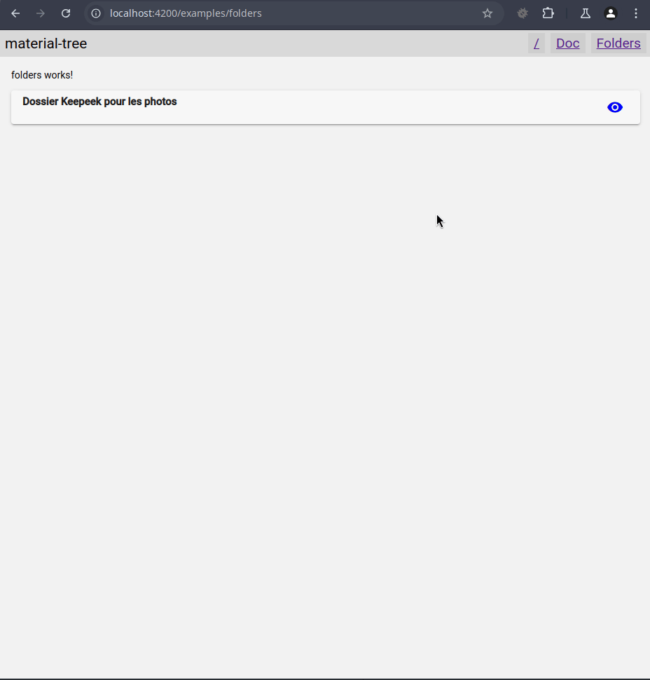

# MaterialTree

# MaterialTree

## What & why

This is a prototype for a component I did at work where we needed a dynamic tree implemented with Material.

The issue is the following:
- We want to display a list of folder, and select one specific folder
- We might have a pre-selected folder, known by id only, path unknown
- We cannot unfortunately ask for the whole tree at once, we have to ask it folder by folder
- The API for discovering a folder's content is fickle, and may fail sometime
- To alleviate the rate of error, it's safer to ask for one folder at a time.
- However, our folder tree is considered fixed, once we got a folder's immediate content we don't have to worry about stale data
- And another good thing is that our folder tree is a DAG, we don't have to worry infinite loops of folders :)
- And we want to show it with @Angular (14) & Material

The main attraction of this project is in the "Folders" section, on the top-right header section.
We have a mock folder tree, with a default selected value of "Horse", but we don't know in advance
the path for this folder, so I opted to look for it in a breadth-first graph search.

The "plants" folder is designed to first the first time we try to load it, to mimic the fickle API behavior.

Note: we don't necessarily have to pre-fetch the whole tree, we just need to display the currently selected one, if any.

## Demo

## Default stuff

This project was generated with [Angular CLI](https://github.com/angular/angular-cli) version 14.2.11.

### Development server

Run `ng serve` for a dev server. Navigate to `http://localhost:4200/`. The application will automatically reload if you change any of the source files.

### Code scaffolding

Run `ng generate component component-name` to generate a new component. You can also use `ng generate directive|pipe|service|class|guard|interface|enum|module`.

### Build

Run `ng build` to build the project. The build artifacts will be stored in the `dist/` directory.

### Running unit tests

Run `ng test` to execute the unit tests via [Karma](https://karma-runner.github.io).

### Running end-to-end tests

Run `ng e2e` to execute the end-to-end tests via a platform of your choice. To use this command, you need to first add a package that implements end-to-end testing capabilities.

### Further help

To get more help on the Angular CLI use `ng help` or go check out the [Angular CLI Overview and Command Reference](https://angular.io/cli) page.
